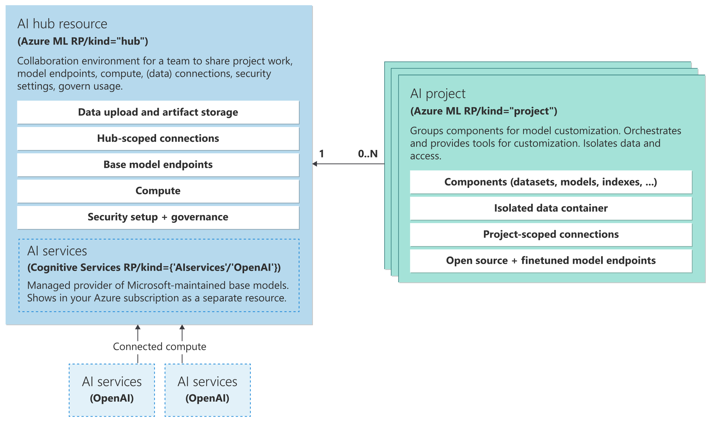
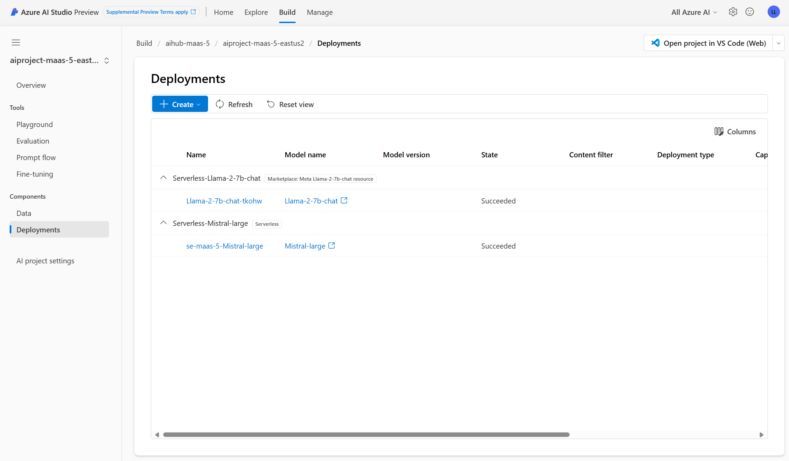
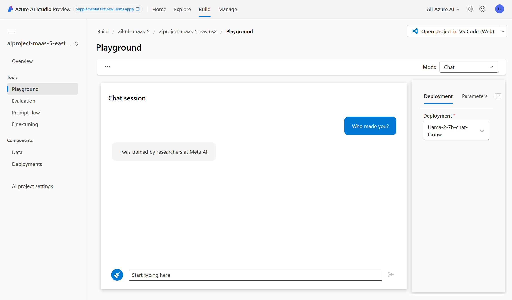
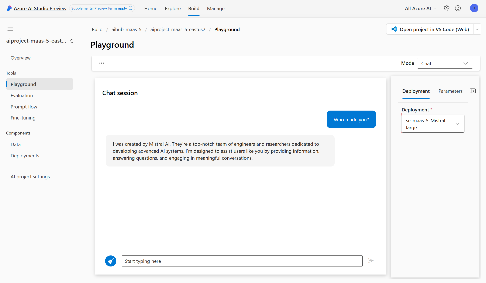

# Introduction

A project to deploy Azure AI Studio Models-as-a-Service using Terraform. Aimed to Application developers building Intelligent applications and platform engineers who are responsible for democratizing access to Generative AI models and want to tap into the value of using Mistral or Llama2 models the same way they use Azure OpenAI, just an API call and no infrastructure to manage ✅.

I have found that companies are blocked when it comes to deploying Model-as-a-Service for a few reasons:

- Companies that do Everything-as-Code cannot leverage the Azure Portal or Azure AI Studio wizards to deploy Model-as-a-Service, hence, they are blocked.
- With Models-as-a-Service being new(as of March 2023), there are no Terraform resources available yet. The recommendation in this case is to use the `azapi_provider` which allows to call any Azure API.
- Model-as-a-Service is built on top of Azure Machine Learning, the underlying resource provider names will not match the resource names that an engineer sees in the Azure Portal. This makes it difficult to understand what providers and APIs should be used.

This project aims to solve these problems by providing a Terraform module to deploy Model-as-a-Service using the `azapi_provider`.

What model's are we deploying?
- Mistral-Large 
- Llama2

For a complete list of models, refer to [Azure AI Studio Models' Catalog](https://ai.azure.com/explore/models)

# What are we deploying?

Strongly recommend to get familiar with the Azure AI Studio Architecture to understand the resources that are being deployed.

AI Studio provides a unified experience for AI developers and data scientists to build, evaluate, and deploy AI models through a web portal, SDK, or CLI. It's built on capabilities and services provided by other Azure services.

The top level AI Studio resources (AI hub and AI projects) are based on Azure Machine Learning. Other resources, such as Azure OpenAI, Azure AI Services, and Azure AI Search, are used by the AI hub and AI project.

- AI hub: The AI hub is the top-level resource in AI Studio. The Azure resource provider for an AI hub is Microsoft.`MachineLearningServices/workspaces`, and the kind of resource is `Hub`.
- An AI project is a child resource of the AI hub. The Azure resource provider for an AI project is Microsoft.`MachineLearningServices/workspaces`, and the kind of resource is `Project`. It inherits the AI hub's connections, and compute resources.

An AI hub has the following dependencies:
- Azure Key Vault to store secrets, such as the API keys for Model-as-a-Service deployments.
- Azure Storage account to store the AI project's data and artifacts.
- Azure Application Insights to monitor the AI project's performance.

There are other optional dependencies that we won't require to deploy Model-as-a-Service, such as Container Registry, Azure Cognitive Search, etc.

Read more [Azure AI Studio Architecture](https://learn.microsoft.com/en-us/azure/ai-studio/concepts/architecture)

# How are we deploying?

The project was created using the `Azure Developer CLI`, that's the recommended approach. However, you might opt to just use the Terraform code and deploy it using the `Terraform CLI` or your own CI/CD pipeline.

## Prerequisites

- An Azure Subcription
- [Azure Developer CLI](https://learn.microsoft.com/en-us/azure/developer/azure-developer-cli/overview)
- [Terraform CLI](https://learn.hashicorp.com/tutorials/terraform/install-cli)

The principal deploying must have permissions to perform Marketplace transactions. Refer to the following links for details about what RBAC roles are required for each model:

- [Llama2 family](https://learn.microsoft.com/en-us/azure/ai-studio/how-to/deploy-models-llama?tabs=azure-studio)
- [Mistral family](https://learn.microsoft.com/en-us/azure/ai-studio/how-to/deploy-models-mistral?tabs=azure-studio)

## Deploying using Azure Developer CLI

1. Clone the repository
2. Run `azd env new` to create a new environment
3. Run `azd up` and select a target subscription and a region. Models are not available in all regions, refer to the links above for the list of supported regions.

You can configure what model to deploy using Terraform flags on `main.tf`. The default is to deploy Mistral-Large.

# What's next?

After deploying Model-as-a-Service, you can go to Azure AI Studio to grab the API endpoint and API Key to start using the model. Alternatively, you use the Azure AI Studio playground.

# Contributing

This project is open for contributions. If you have any feedback, please open an issue. If you want to contribute, please open a pull request.
